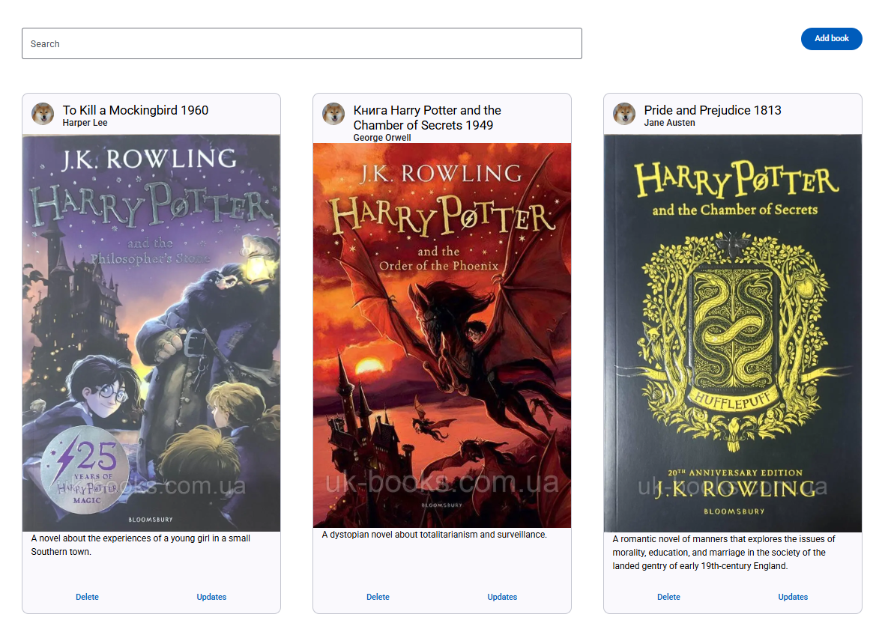

# My Library App

A simple web application for managing a personal book collection. Users can view, search, add, update, and delete books
in a clean, responsive card-based interface.



## 🚀 Features

- **Search**: Quickly filter books by title, author, or year using the search bar.
- **Add Book**: Add new entries with title, author, publication year, cover image URL, and description.
- **Responsive Grid**: Book cards adjust to different screen sizes for optimal viewing.
- **CRUD Operations**:

  - **Create**: Click **Add book** to open a form and add a new book.
  - **Read**: Browse your library via cards showing the book cover, title, author, year, and a short description.
  - **Update**: Click **Updates** on a card to edit the book’s details.
  - **Delete**: Remove unwanted books instantly with the **Delete** button.

- **Clean UI**: Minimalist design with clear typography, cards, and buttons.

## 📦 Tech Stack

- **Framework**: Angular
- **UI Library**: Tailwind CSS
- **Build Tool**: Angular CLI

## 💻 Getting Started

1. **Clone the repo**

   ```bash
   git clone https://github.com/AndrewT9/Book-Warehouse.git
   cd book-warehouse
   ```

2. **Install dependencies**

   ```bash
   npm install
   # or yarn install
   ```

3. **Run in development mode**

   ```bash
   npm run dev
   # or yarn dev
   ```

4. **Build for production**

   ```bash
   npm run build
   # or yarn build
   ```

## 🤝 Contributing

1. Fork the repository
2. Create feature branch (`git checkout -b feature/awesome`)
3. Commit changes (`git commit -m 'Add awesome feature'`)
4. Push branch (`git push origin feature/awesome`)
5. Open a Pull Request
